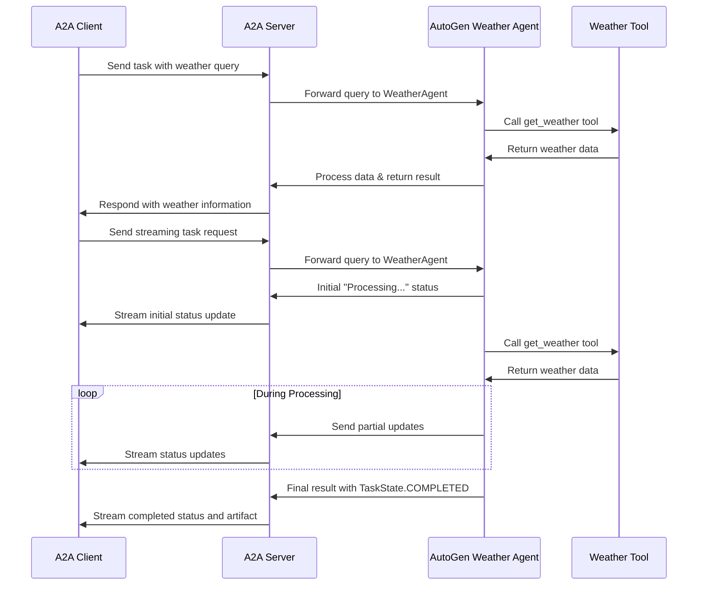

# AutoGen A2A Weather Agent

This sample demonstrates how to implement an A2A protocol server using Microsoft's [AutoGen](https://microsoft.github.io/autogen/stable/user-guide/agentchat-user-guide/index.html) framework. The implementation creates a simple Weather Agent that provides (simulated) weather information via tool calls for various locations.

## Overview

The Weather Agent is implemented as a RoundRobinGroupChat with a single AssistantAgent that has access to a simulated weather lookup tool. The implementation follows the A2A protocol specification for agent-to-agent communication.

Key features:

- Agent capability discovery via an AgentCard
- Task management with proper state tracking
- Streaming support using Server-Sent Events (SSE)
- Simple stateful conversations

## Implementation Structure

The implementation consists of four key files:

1. **agent.py**: Contains the WeatherAgent class that wraps AutoGen's AssistantAgent and RoundRobinGroupChat.
2. **task_manager.py**: Implements the A2A protocol task management for the agent.
3. \***\*main**.py\*\*: Entry point that sets up and starts the A2A server.
4. **pyproject.toml**: Defines project dependencies and metadata.

## How It Works

The following diagram illustrates the flow of communication between the client, server, and agent:



## Prerequisites

- Python 3.12 or higher
- OpenAI API key

## Setup & Running

1. Navigate to the samples directory:

   ```bash
   cd samples/python/agents/autogen
   ```

2. Setup the environment file with your Open

   ```bash
   export OPENAI_API_KEY=your_openai_api_key
   ```

3. Set up the Python environment:

   ```bash
   uv python pin 3.12
   uv venv
   source .venv/bin/activate
   ```

4. Run the agent with desired options:

   ```bash
   # Basic run
   uv run .

   # On custom host/port
   uv run . --host 0.0.0.0 --port 10000
   ```

5. In a separate terminal, run the A2A client:

   ```bash
   # Connect to the agent (specify the agent URL with correct port)
   uv run hosts/cli --agent http://localhost:10000

   # If you changed the port when starting the agent, use that port instead
   # uv run hosts/cli --agent http://localhost:YOUR_PORT
   ```

## Limitations

- Uses a simulated weather API with a limited set of predefined locations
- No authentication or rate limiting
- In-memory storage (state is lost when server restarts) (You can persist data using the AutoGen `team.save_state()` and `team.load_state()` methods in AutGen. See the [AutoGen Managing State documentation](https://microsoft.github.io/autogen/dev/user-guide/agentchat-user-guide/tutorial/state.html) for more details.)

## Further Enhancements

Potential improvements to the implementation:

- Add integration with a real weather API
- Implement authentication and authorization
- Add persistent storage for tasks and sessions
- Support for forecasts and historical weather data
- Add location detection support

## References

- [A2A Protocol](https://github.com/google/A2A)
- [AutoGen Framework](https://microsoft.github.io/autogen/stable/user-guide/agentchat-user-guide/index.html)
