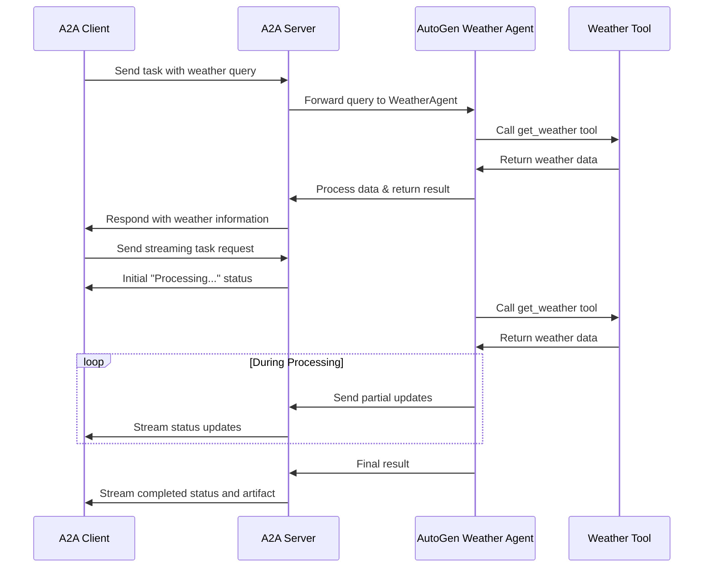

# AutoGen A2A Weather Agent

This sample demonstrates how to implement an A2A protocol server using Microsoft's AutoGen framework. The implementation creates a simple Weather Agent that provides weather information for various locations.

## Overview

The Weather Agent is implemented as a RoundRobinGroupChat with a single AssistantAgent that has access to a weather lookup tool. The implementation follows the A2A protocol specification for agent-to-agent communication.

Key features:

- Agent capability discovery via an AgentCard
- Task management with proper state tracking
- Streaming support using Server-Sent Events (SSE)
- Simple stateful conversations

## Implementation Structure

The implementation consists of four key files:

1. **agent.py**: Contains the WeatherAgent class that wraps AutoGen's AssistantAgent and RoundRobinGroupChat.
2. **task_manager.py**: Implements the A2A protocol task management for the agent.
3. \***\*main**.py\*\*: Entry point that sets up and starts the A2A server.
4. **pyproject.toml**: Defines project dependencies and metadata.

## How It Works

The following diagram illustrates the flow of communication between the client, server, and agent:



## Prerequisites

- Python 3.12 or higher
- OpenAI API key

## Installation

1. Clone the repository:

   ```bash
   git clone https://github.com/yourusername/a2a-autogen-weather.git
   cd a2a-autogen-weather
   ```

2. Install the dependencies:

   ```bash
   pip install -e .
   ```

3. Set the OpenAI API key:
   ```bash
   export OPENAI_API_KEY=your-openai-api-key
   ```

## Running the Server

Start the server with:

```bash
python -m a2a_autogen_weather
```

Or specify a custom host and port:

```bash
python -m a2a_autogen_weather --host 0.0.0.0 --port 8080
```

## Using the A2A Weather Agent

Once the server is running, you can interact with it using any A2A-compatible client. The agent provides a weather information service with:

- Current temperature
- Weather conditions
- Humidity

Sample Queries:

- "What's the weather like in Tokyo?"
- "How's the weather in New York?"
- "What's the temperature in London?"
- "Weather in Paris"

## A2A Protocol Integration

The implementation follows the A2A protocol by:

1. Exposing an Agent Card at `/.well-known/agent.json`
2. Supporting task creation through `tasks/send`
3. Supporting streaming through `tasks/sendSubscribe`
4. Following the A2A task lifecycle (submitted → working → completed)

## WeatherAgent Implementation

The WeatherAgent wraps AutoGen's AssistantAgent with a weather tool:

```python
self.weather_assistant = AssistantAgent(
    name="weather_assistant",
    model_client=self.model_client,
    system_message="You are a helpful weather assistant...",
    tools=[get_weather],
    model_client_stream=True,
)

self.team = RoundRobinGroupChat(
    [self.weather_assistant],
    termination_condition=self.termination
)
```

## Limitations

- Uses a simulated weather API with a limited set of predefined locations
- No authentication or rate limiting
- In-memory storage (state is lost when server restarts)

## Further Enhancements

Potential improvements to the implementation:

- Add integration with a real weather API
- Implement authentication and authorization
- Add persistent storage for tasks and sessions
- Support for forecasts and historical weather data
- Add location detection support

## References

- [A2A Protocol](https://github.com/google/A2A)
- [AutoGen Framework](https://microsoft.github.io/autogen/)
